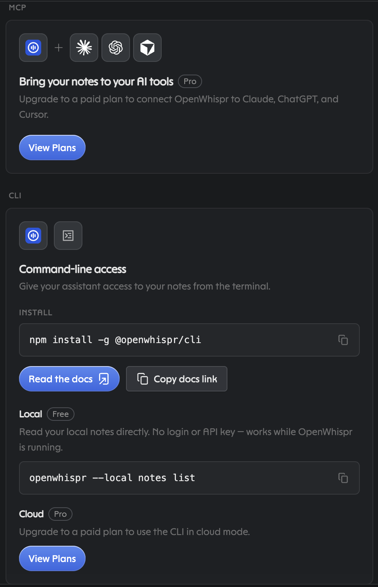
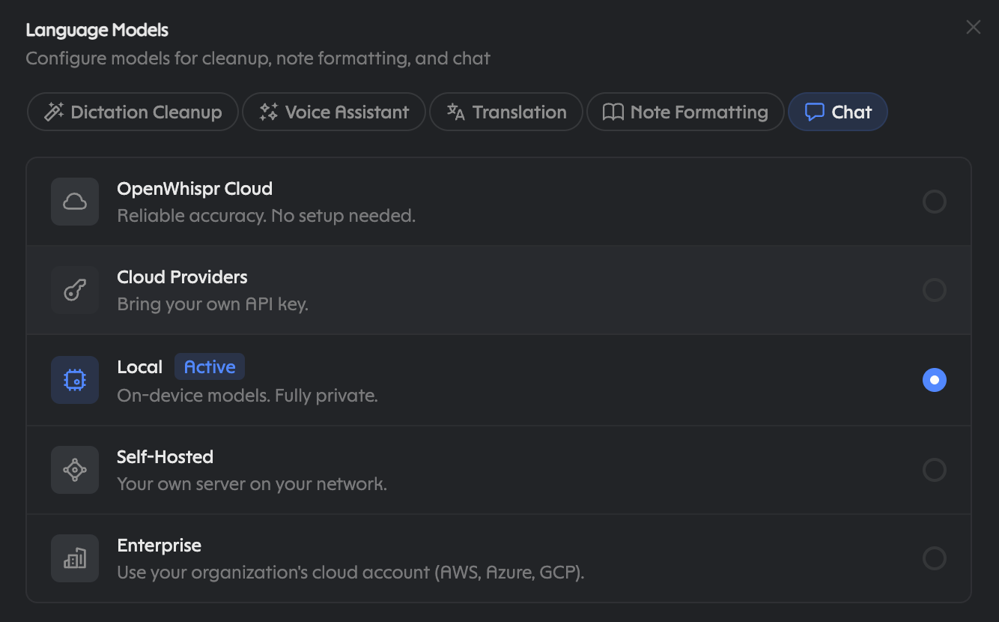
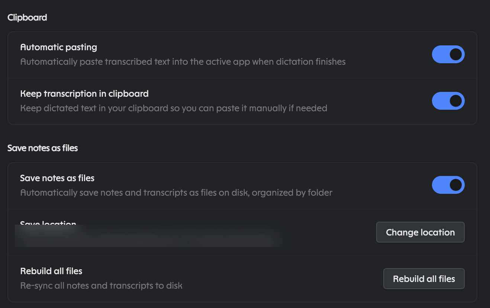
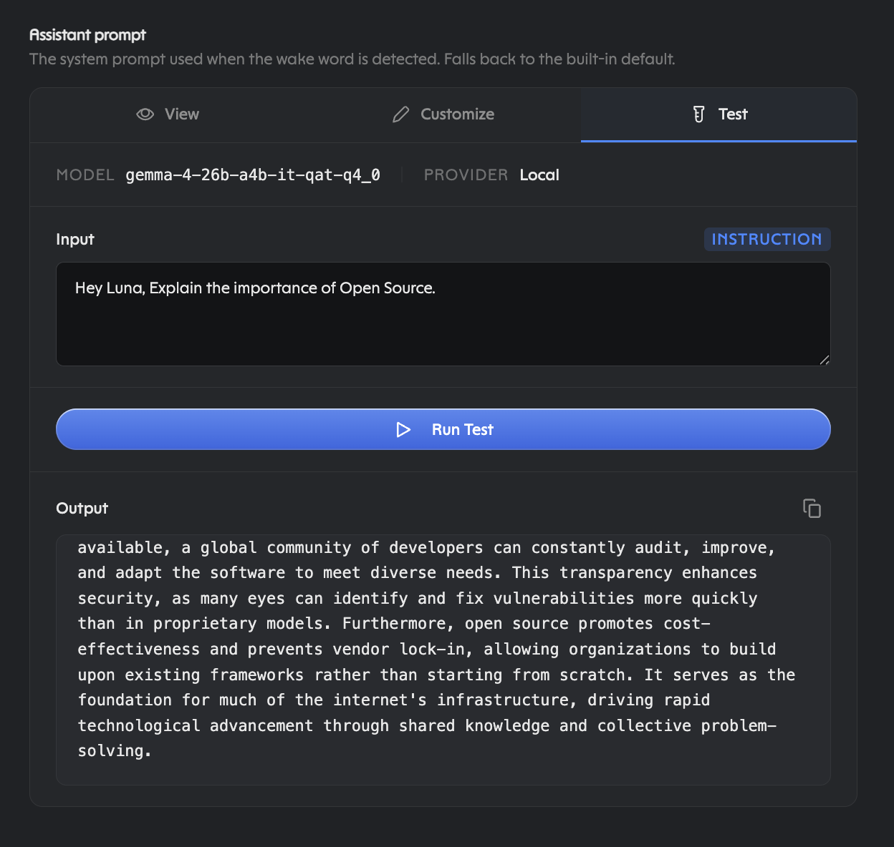

# claude-openwhispr

One skill, no code. It teaches Claude to search what you dictated, read and
write OpenWhispr notes, and transcribe local audio, all through the
`openwhispr` CLI and Bash. Local by default; cloud only if you say so.

**You dictate and want your words found:**

```bash
brew install --cask openwhispr     # or openwhispr.com/download
# open the app, press your dictation hotkey, say something
npm install -g @openwhispr/cli
openwhispr --local notes list --limit 1   # local bridge reachable
```

Then add the plugin inside Claude Code:

```
/plugin marketplace add mooserini/claude-openwhispr
/plugin install openwhispr@openwhispr
```

One worked session, the whole product:

> You: "find what I just dictated about the dentist"
> Claude: `openwhispr --local transcriptions list --limit 50 --format json | jq …` (filters for "dentist")
> → transcription id 42, `created_at` this morning → your words, quoted back with id + timestamp.

The skill loads as `/openwhispr:openwhispr` and Claude reaches for it
on its own when you ask about something you said.

## What it does

- Reads your OpenWhispr dictation history so Claude can find what you
  said, even when you can't remember it.
- Reads, searches, and (with your say-so) writes OpenWhispr notes as a
  handoff surface between agents.
- Transcribes local audio with your desktop model, optionally filing it
  straight to a note.
- Manages dictionary words and snippets.

What it doesn't do: include assistant replies, replace whatever voice input
you already use, or touch the cloud unless you explicitly opt in. It does run
commands and put what it finds in front of Claude, so read
[Things worth knowing before you install](#things-worth-knowing-before-you-install)
first.

## Why OpenWhispr

Because OpenWhispr sits at voice input rather than inside any one app, it is
a rolling record of everything you say, whichever app or agent heard it. The
screenshots below are of their application; read top to bottom.

- **Per-feature model choice.** Dictation Cleanup, Voice Assistant,
  Translation, Note Formatting, Chat each pick independently: OpenWhispr
  Cloud, your own cloud key, Local (private, on-device), Self-Hosted, or
  Enterprise.
- **Nothing learns silently.** Auto-learn from corrections is off until you
  enable it.
- **A second trail on disk.** Optional file export saves your *notes*, and
  the transcripts attached to them, as Markdown in a folder you choose,
  which Claude can read directly. It does not export individual dictations.
- **Honest runtimes.** whisper.cpp and sherpa-onnx, bundled: no Python stack
  to install, Metal on Apple Silicon, CUDA/Vulkan elsewhere, CPU fallback.

### Integrations: assistant upsell on top, free CLI below



The paid connector card catches the eye first; the CLI card underneath is the
free half. Individual dictations live in the transcriptions list (notes are
things you made on purpose): `openwhispr --local transcriptions list --limit 50`
shows IDs and times, and `--format json` adds the text.

### Per-feature model picker



### Auto-learn from corrections (shown after enabling it)


### Clipboard flow and save-notes-as-files (save path redacted)



### Optional calendars and paywalled API access (account email redacted)


### Dictation engines: four tiers, four local vendors


### Dictation Cleanup downloads: six vendors, honest sizes


### Same question, two brains: local vs cloud




## Privacy is yours to tune

- **Local:** free, no login, audio never leaves your machine. Needs the
  OpenWhispr desktop app running (loopback bridge; the live port is recorded
  in the CLI's bridge file). The default, and works without any key.
- **Cloud:** opt-in only. Needs a paid plan plus `openwhispr auth login`; the
  key lives in the CLI's own config. Cloud transcription is beta with no SLA;
  files over 4 MB are chunked client-side and need `ffmpeg` on PATH.
- **Reads vs writes:** reads and searches are always safe. Creates, updates,
  and deletes only happen with your explicit consent, every time.
- **Dictionary:** a hint to the model, not an override. Export it before
  moving machines.

## Disclosures

- Shell-outs to `openwhispr *` through the Bash tool only.
- Local network: loopback desktop bridge when using `--local`. The app writes
  a one-time bearer token to its own bridge file (mode `0600`) at startup and
  the CLI reads it automatically, so loopback is authenticated, not open.
- Remote network: api.openwhispr.com only when you opt into `--remote`.
- The agent never opens credential files itself: the vendor CLI reads its own
  bridge token (`~/.openwhispr/cli-bridge.json`) and
  `~/.openwhispr/cli-config.json` (both `0600`). Key setup includes the agent
  bootstrap flow (`/auth/email-code`, a 6-digit code the user pastes,
  `POST /keys/create` for a scoped key), always with consent.
- No hooks, no MCP servers, no executable code, no self-updater, no
  telemetry. The plugin is a manifest and a Markdown file.

## Things worth knowing before you install

The parts people might reasonably raise an eyebrow at, named up front.

- **What Claude reads leaves your machine.** OpenWhispr is local, and the
  CLI talks to it over loopback. But when Claude searches your dictations,
  the matching text becomes part of your conversation with Claude, and is
  handled under your Claude plan's data terms. "Local" describes where
  OpenWhispr keeps your words, not where they go once an agent reads them.
  Dictation can contain anything you said aloud, so ask for a narrow search
  rather than "everything from last week" if that matters.
- **The consent rules are instructions, not a sandbox.** The skill tells
  Claude to read freely, to write, update or delete only with your say-so
  each time, and to touch the cloud only when you ask in that turn. That is
  guidance to the model. The hard gate is Claude Code's own permission
  prompt on each Bash command, so read what you approve, especially
  anything with `--remote`, `delete`, `auth login`, or `--content`.
- **It runs commands.** The skill's whole job is to have Claude run the
  `openwhispr` CLI through Bash. There is no other code in this plugin, but
  the CLI is third-party software installed globally with npm
  (`@openwhispr/cli`). You are trusting that package and the OpenWhispr
  desktop app; this plugin vouches for neither.
- **Cloud setup can mint a permanent key.** If you ask for cloud access
  and have no desktop app, the skill describes an email-code flow that ends
  in a scoped API key stored in the CLI's own config. It runs only when you
  ask for cloud setup, and it needs you to paste the emailed code, so it
  cannot finish on its own. It is the most sensitive thing in the skill,
  which is why it is spelled out here.
- **Notes persist and other agents can read them.** Notes written as
  handoffs stay in your OpenWhispr notes (and in the on-disk export, if you
  enabled it) until you delete them. Anything another agent or tool can
  read there can read what Claude wrote.
- **It only sees what OpenWhispr captured.** The skill cannot reach
  outside its own sandbox for your context. Words spoken into another
  app's built-in voice (LM Studio Bionic, a phone assistant, a meeting
  tool) never enter your OpenWhispr history, so a search will not find
  them. Dictate through OpenWhispr when you want something to be findable
  later, and keep it findable on purpose: with Data Retention off, text is
  pasted and nothing is stored. If you turn on "Save notes as files",
  OpenWhispr writes Markdown to a folder you choose, and Claude can read
  that folder directly. In the author's testing that folder held only
  notes and the transcripts attached to them. Individual dictations never
  landed there, so reaching those takes the CLI
  (`openwhispr --local transcriptions list`), which is a deliberate act
  rather than a folder you can browse.
- **Tested for structure, not for the app.** The test suite checks the
  manifest, the skill's frontmatter, the README's links and the absence of
  hooks or code. It does not drive a live OpenWhispr app. Command syntax
  comes from OpenWhispr's published CLI docs, and the author has run the
  commands against the live app. The author also reports using the same
  skill text with other agents, including local models in LM Studio, its
  Bionic agent app, and OpenCode; that is a firsthand report, not something this repo's
  tests cover, and how well a small model follows the consent rules will
  vary. CLI flags can change; if one drifts, please open an issue.
- **Product claims are theirs, not ours.** Feature and pricing descriptions
  here (paid cloud tiers, model lists, integrations) reflect OpenWhispr's
  docs and the screenshots shown when this was written. They may be out of
  date, and this project is not affiliated with or endorsed by OpenWhispr
  or Anthropic.

## Attribution

- **OpenWhispr** makes the dictation app, the CLI (`@openwhispr/cli`), the
  cloud API, and the docs at docs.openwhispr.com this plugin leans on. All
  screenshots are of their application; all product names and marks are
  theirs.
- **Claude and Claude Code** are Anthropic's. This is independent community
  work by [Thomas Kenny](https://github.com/mooserini), published under MIT,
  affiliated with neither party and claiming no
  endorsement from either.

## Layout

```
claude-openwhispr/
├── .claude-plugin/
│   ├── plugin.json
│   └── marketplace.json
├── skills/openwhispr/SKILL.md
├── icon.png
├── docs/social-preview.png
├── docs/screenshots/
├── tests/test_plugin.py
├── README.md
├── CONTRIBUTING.md
└── LICENSE
```

## Smoke test

```bash
openwhispr --local notes list --limit 1   # exit 0, local bridge reachable
openwhispr --local transcriptions list --limit 5
python -m pytest tests/ -q
```

Then, in Claude Code: ask "what did I dictate about the dentist?" and watch
it run the search.
